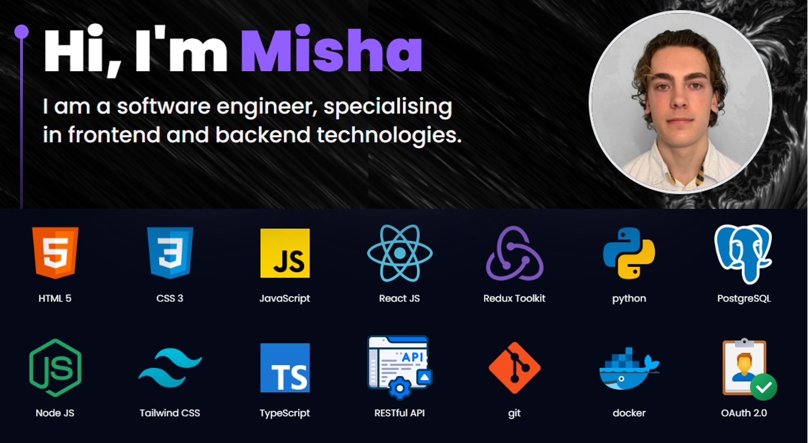

### Hi there 👋, I am Misha: a highly driven graduate from Warwick University seeking a software or data engineering role. I am constantly looking to broaden and improve my skill set through projects and certifications.

Skills: Python / RestAPIs / Javascript / React / Apache / Kafka /
